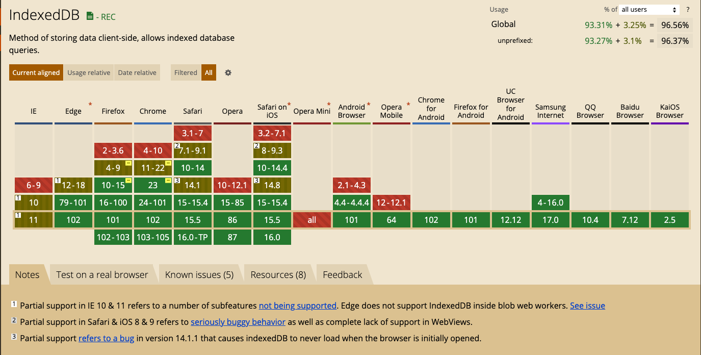

# IDB-Promise
踩的坑很多。。后来也看到很多indexeddb的promise化，没有看到比较好的或者有的根本不靠谱
alasql貌似不错，但并不是持久化。几万数据的话还能撑住。 Dexie.js 不错的，用TS写的 但是需求不需要那么复杂就没采纳

坑点：
* 每次open database后 onsuccess 必须要 e.target.result.close()  不然之后再open的话会报错 AbortError  应该是库被block了
* 测试下来  平均插入1w的数据 耗时1s   后来20w的数据分了40组 每组5000个。。100w的话要10s。。。20w取出来的时候也要300ms左右。。。内容越少取出来越快

</img>

[IndexedDB MDN](https://developer.mozilla.org/zh-CN/docs/Web/API/IndexedDB_API)

# 存储大量数据
之前的cookie存储只有不超过4KB，localStorage有2.5-10M左右，而indexDb一般来说不少于 250MB，甚至没有上限。

拓展：那么我们什么情况下需要存储大量数据呢？首先是你的应用场景需要大量数据的时候，具体可能分为以下的场景：
* 单条数据的请求比较耗时，解析比较耗时，那么建议针对这个数据进行前端存储，然后使用时直接使用前端部分的即可。前提是这部分的数据能得到一个数据戳，能保证使用本地库没有问题。
* 多个接口请求的数据，在微服务大兴的时候，前端往往需要请求多个接口才能完成一个完整功能的实现，那么这种情况下，使用本地数据库具有明显的优势，比前端枚举数据具有实时性，比请求多接口具有响应快的优势
* 跨页面存储。虽然现在主流的框架具有vuex或者redux相关的技术，可以实现前端数据的内存管理，但是其不能较好的控制更复杂的数据，索引数据。所以在复杂数据共享方案上，这个能起到很好的作用。如果在跨页面的方案中，能针对性的设置一些比较好的表和字段，是比单纯的内存对象管理方式优化的。
* 本地缓存，离线缓存。在需要提升用户体验的时候，将必要的一些数据缓存到数据库，可以提升用户体验，避免用户完全无数据完全无法操作的糟糕体验。

# 键值对储存
IndexedDB 内部采用对象仓库（object store）存放数据。所有类型的数据都可以直接存入，包括 JavaScript 对象。对象仓库中，数据以"键值对"的形式保存，每一个数据记录都有对应的主键，主键是独一无二的，不能有重复，否则会抛出一个错误。
拓展： 相比于原来的只能某个字段装某个对象的情况，数据库无疑具有更好的优势，可以在查询以及赋值时有更加的便利性。

# 异步
IndexedDB 操作时不会锁死浏览器，用户依然可以进行其他操作，这与 LocalStorage 形成对比，后者的操作是同步的。异步设计是为了防止大量数据的读写，拖慢网页的表现。
拓展： 还是大量数据的读取，如果是localStorage会让浏览器的其他行为中止，因为是同步的，影响用户体验。

# 支持事务
IndexedDB 支持事务（transaction），这意味着一系列操作步骤之中，只要有一步失败，整个事务就都取消，数据库回滚到事务发生之前的状态，不存在只改写一部分数据的情况。
拓展： 避免中间步骤导致的数据操作从而造成的数据污染。

# 同源限制
IndexedDB 受到同源限制，每一个数据库对应创建它的域名。网页只能访问自身域名下的数据库，而不能访问跨域的数据库。（这点与以前的方式相比，不算优势，属于必要的补充）

# 支持二进制储存
IndexedDB 不仅可以储存字符串，还可以储存二进制数据（ArrayBuffer 对象和 Blob 对象）
拓展： 可以很好的缓存用户记录，在不进行新的接口请求时，拿到用户的操作记录，尤其是历史的表格、图片等，能大幅度提升用户体验，降低后端压力。

[Dexie](https://github.com/dexie/Dexie.js)